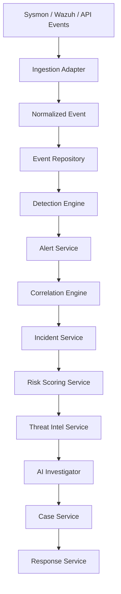
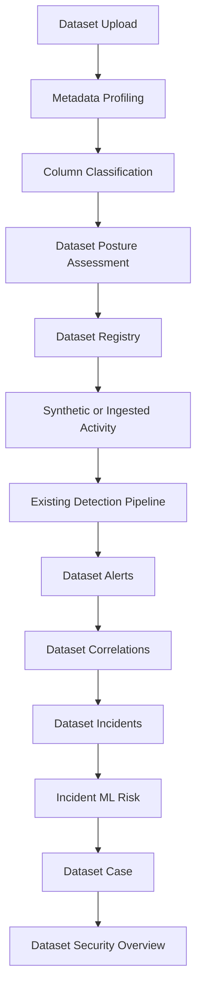

# IncidentForge Jury Presentation Guide

## 1. Project Overview

IncidentForge is a defensive Security Operations Center platform that helps analysts move from raw telemetry to an explainable, auditable response workflow.

The platform combines:

- Event ingestion and normalization
- Rule-based detection
- Alert correlation
- Incident creation
- Explainable ML risk prioritization
- Threat-intelligence enrichment
- AI-assisted investigation
- Case management
- Analyst-approved response simulation
- Dataset security monitoring

The central design principle is human-in-the-loop security. IncidentForge assists the analyst, but it does not make uncontrolled autonomous containment decisions.

## 2. The Main Architecture


Each stage has a clear responsibility:

1. **Adapter:** Accepts telemetry from a source such as a fixture, Wazuh, Sysmon, or dataset activity.
2. **Normalization:** Converts different input formats into the canonical IncidentForge event model.
3. **Persistence:** Stores events and audit records in the development SQLite database.
4. **Detection:** Applies deterministic security rules.
5. **Alerting:** Creates structured alerts with evidence and severity.
6. **Correlation:** Groups related alerts into attack sequences.
7. **Incident creation:** Converts meaningful correlations into incidents.
8. **ML risk scoring:** Prioritizes incidents using bounded, explainable features.
9. **Threat intelligence:** Adds indicator context where available.
10. **AI investigation:** Summarizes evidence and recommends next steps.
11. **Case management:** Gives analysts an accountable investigation record.
12. **Response:** Allows controlled, analyst-approved actions.
13. **Audit:** Records important decisions and state transitions.
14. **Dashboard:** Presents the workflow to the SOC analyst.

## 3. Version 1: Core SOC Incident Pipeline

Version 1 focuses on traditional security telemetry and incident response.



### Version 1 explanation for the jury

> Version 1 is the core SOC workflow. It receives security events, normalizes them, detects suspicious behavior, correlates related alerts, creates incidents, scores their risk, enriches them with context, and gives the analyst controlled investigation and response capabilities.

### Important Version 1 properties

- Duplicate event IDs are rejected deterministically.
- Alerts preserve their source evidence.
- Correlation reduces alert noise.
- Incidents preserve links to events, alerts, and correlations.
- ML scores are explainable through feature contributions and reason codes.
- Response actions require analyst control.
- Audit records support accountability and later review.

## 4. Version 2: Dataset Security Extension

Version 2 adds security monitoring for uploaded datasets such as CSV, JSON, and Parquet files.



### Version 2 explanation for the jury

> Version 2 extends the existing SOC pipeline to protect data assets. It profiles dataset metadata without storing raw rows, identifies probable sensitive fields, monitors suspicious access behavior, and routes that behavior through the same detection, correlation, incident, ML, case, and audit workflow used by the core SOC system.

### Dataset activity scenario

The demonstration simulation generates four synthetic activities:

1. `dataset_opened`
2. `sensitive_column_access`
3. `bulk_access`
4. `dataset_exported`

These events are synthetic. They do not access or modify a real external system. They are passed through the normal IncidentForge pipeline so the demo represents a realistic security workflow.

## 5. Explaining the Two Scores

The two scores intentionally measure different layers of risk.

### 5.1 Dataset Posture Health

Example:

```text
100 / 100
LOW RISK
```

This score evaluates the static structure of the uploaded dataset:

- Column names
- Probable PII fields
- Credential-like names
- Financial identifiers
- Schema anomalies
- Sensitivity classification

Its direction is:

```text
100 = healthier dataset posture
0 = more concerning dataset posture
```

A score of 100 means the profiler found no significant structural concerns. It does **not** mean that the dataset cannot be attacked.

### 5.2 Incident Threat Risk

Example:

```text
34 / 100
MEDIUM
```

This score evaluates observed runtime behavior:

- Alert severity
- Event count
- Correlation severity
- Dataset activity
- Bulk access
- Export activity
- Records accessed
- Sensitive-column access
- Exfiltration indicators
- Network behavior

Its direction is:

```text
0 = lower observed threat risk
100 = higher observed threat risk
```

### 5.3 Why both can be correct

This combination is valid:

```text
Dataset posture health: 100 / 100
Observed incident threat risk: 34 / 100
```

The correct interpretation is:

> The file structure did not look sensitive to the static profiler, but the observed access behavior was suspicious enough to create a medium-risk incident.

This is not a mathematical contradiction. It is a separation between **data-at-rest posture** and **behavioral threat risk**.

## 6. Why the Risk Score Previously Changed

The ML inference model is deterministic. The original simulation behavior was not reproducible because every button click generated new timestamps and event IDs.

The old flow was effectively:

```text
Same CSV
+ new synthetic events
+ new alerts
+ updated correlations
= different incident features
= recalculated score
```

The simulation has been corrected so each dataset has a stable scenario identity:

- Stable event IDs
- Stable synthetic timestamps
- Duplicate events skipped
- No repeated accumulation for the same scenario
- Stable risk score for the same dataset state

Therefore, repeated simulation clicks should now return the same backend-derived score for the same dataset scenario.

## 7. Why Cases Were Previously Empty

The initial pipeline created incidents and risk assessments, but it did not automatically create a case after incident creation.

The earlier flow stopped at:

```text
Event -> Alert -> Correlation -> Incident -> ML Risk
```

The expected SOC flow is:

```text
Event -> Alert -> Correlation -> Incident -> ML Risk -> Case
```

The missing call to `CaseService.create_case()` caused the dashboard to show incidents while the case count remained zero.

The flow has now been extended so dataset simulation creates a deterministic case for each affected incident.

A generated case contains:

- Case ID
- Dataset-specific title
- Description
- Linked incident ID
- Severity
- Priority
- Open status
- Dataset tag
- Evidence references
- Audit record

The priority is derived from incident severity:

| Incident severity | Case priority |
|---|---|
| 12-15 | Critical |
| 8-11 | High |
| 4-7 | Medium |
| 0-3 | Low |

Existing simulations that ran before this fix are not retroactively converted. Uploading or simulating a new dataset scenario creates the new case correctly.

## 8. SOC Analyst Workflow

### Step 1: Triage alerts

The analyst checks:

- Severity
- Rule name
- Source host
- User
- Timestamp
- Evidence
- Related alerts

### Step 2: Review correlations

The analyst asks whether multiple alerts belong to one attack sequence by checking:

- Shared host
- Shared user
- Shared IP
- Time window
- Rule relationships
- Common entities

### Step 3: Open the incident

The analyst reviews:

- Incident severity
- Status
- Timeline
- Related events
- Related alerts
- Correlations
- MITRE techniques
- Evidence

### Step 4: Use ML risk for prioritization

The analyst checks:

- Risk score
- Risk level
- Model version
- Feature version
- Reason codes
- Feature contributions

The score prioritizes work. It does not replace analyst judgment.

### Step 5: Use AI investigation carefully

The AI Investigator should be used to:

- Summarize observed evidence
- Separate observed facts from inference
- Identify investigation gaps
- Recommend next steps

The analyst must validate AI output against the underlying evidence.

### Step 6: Create or review the case

The analyst records:

- Business impact
- Scope
- Owner
- Priority
- Investigation notes
- Evidence references
- Containment decision

### Step 7: Approve response

The analyst chooses an allowed response action. Destructive or external actions must remain behind approval gates.

### Step 8: Resolve and audit

The analyst records:

- Root cause
- Action taken
- Resolution summary
- Resolver
- Final status
- Relevant timestamps

## 9. What Is Implemented Today

### Implemented

- FastAPI backend
- SQLite persistence for development
- Canonical event, alert, correlation, incident, risk, case, and dataset models
- Rule-based detection
- Alert correlation
- Explainable logistic-regression baseline risk scoring
- Dataset upload and metadata profiling
- Dataset security assessment
- Dataset activity simulation
- Dataset-specific overview
- Deterministic repeated simulation behavior
- Dataset-linked case creation
- Audit records
- Analyst-controlled response workflow
- System settings persistence

### Current limitations

- Authentication is still a mock frontend authentication layer.
- User and meter management are not fully backed by domain APIs.
- Dataset profiling is heuristic and does not prove compliance.
- The ML model is trained on synthetic development data.
- SQLite is appropriate for development but not the final production database.
- Wazuh ingestion needs further validation against live deployment data.
- The Dataset Security page currently emphasizes case counts; a full case-detail panel is the next UI improvement.

## 10. Recommended Next Steps

### Immediate product improvements

1. Add full case details directly inside Dataset Security.
2. Add a case detail page with timeline, notes, evidence, assignment, and resolution.
3. Add simulation history with run ID, score, alerts, incidents, and cases.
4. Display the top ML feature contributions beside each incident score.
5. Add a before-and-after score explanation when new evidence arrives.

### ML improvements

1. Retrain on representative SOC and dataset-security data.
2. Add calibration metrics such as Brier score and reliability curves.
3. Track precision, recall, false-positive rate, and precision at top-k.
4. Add model and feature artifact versioning.
5. Add feature-distribution drift detection.
6. Capture analyst feedback as labels for future training.

### SOC platform improvements

1. Replace mock role toggling with real authentication and RBAC.
2. Add alert suppression and known-benign allowlists.
3. Add SLA timers for acknowledgement, investigation, containment, and resolution.
4. Add structured observability metrics and correlation IDs.
5. Add PostgreSQL and database migrations for production deployment.
6. Validate the Wazuh adapter with replayed real alert payloads.

## 11. Strong Jury Answers

### Why use both rule-based detection and ML?

> Rules are transparent and reliable for known patterns. ML helps prioritize incidents by combining multiple signals. The system uses both because detection and prioritization are different problems.

### Why not let the AI automatically respond?

> Response actions can be destructive. IncidentForge keeps AI advisory and requires analyst approval so the system remains auditable and safe.

### Is the model production-ready?

> The current model is a transparent baseline trained and evaluated on synthetic development data. It is suitable for demonstrating explainable ranking, but production use requires representative telemetry, calibration, drift monitoring, and analyst feedback.

### Why is a clean dataset still capable of producing a high-risk incident?

> Static posture and runtime behavior measure different risks. A dataset can have no obvious sensitive column names and still be accessed or exported suspiciously.

### What happens if the same simulation is run twice?

> The simulation is deterministic per dataset. Stable event identifiers prevent duplicate processing, so the same scenario does not randomly change the risk score.

### What is the main security boundary?

> Raw dataset rows are not exposed through the dashboard. Dataset Security uses sanitized metadata and activity records, while response actions remain analyst-controlled and audited.

## 12. One-Minute Final Explanation

> IncidentForge is a human-in-the-loop SOC platform. Its first version processes security telemetry through normalization, detection, alerting, correlation, incident creation, explainable ML prioritization, investigation, case management, and controlled response. The second version extends the same pipeline to dataset security. It profiles uploaded dataset metadata, calculates a static posture score, monitors suspicious data-access activity, and routes that activity through the existing SOC pipeline. The posture score measures the health of the dataset structure, while the incident risk score measures observed behavior, so they are intentionally different. The current system also creates dataset-linked cases from simulated incidents. The next development priority is a richer case workspace, followed by ML calibration, representative training data, drift monitoring, and production-grade authentication and persistence.
